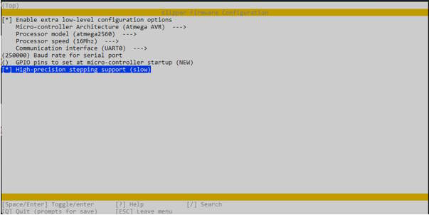

# Configuration reference for Bleeding Edge features

This document is a reference for options available in the Klipper
config file.

The descriptions in this document are formatted so that it is possible
to cut-and-paste them into a printer config file. See the
[installation document](Installation.md) for information on setting up
Klipper and choosing an initial config file.

## High precision stepping and new stepcompress protocol

The configuration for this feature is done during klipper firmware compile 
by selecting "High-precision stepping support" option when making the klipper
firmware. There are no configuration parameters required for this feature.



## Input shaper

### [input_shaper] 
**Extruder PA Synchronization with Input Shaping**


```
[input_shaper] 
#enabled_extruders: extruder
```

**Smooth Input Shapers**


```
[input_shaper]
#shaper_type: 
#   A type of the input shaper to use for both X and Y axes. Supported
#   shapers are smooth_zv, smooth_mzv, smooth_ei, smooth_2hump_ei, smooth_zvd_ei,
#   smooth_si, mzv, ei, 2hump_ei.
#shaper_type_x:
#shaper_type_y:
#   If shaper_type is not set, these two parameters can be used to
#   configure different input shapers for X and Y axes. The same
#   values are supported as for shaper_type parameter.
#smoother_freq_x: 0
#  A frequency (in Hz) of the smooth input shaper for X axis.
#smoother_freq_y: 0
#  A frequency (in Hz) of the smooth input shaper for Y axis.
#damping_ratio_x: 0.1
#damping_ratio_y: 0.1
#   Damping ratios of vibrations of X and Y axes used by input shapers
#   to improve vibration suppression. Default value is 0.1 which is a
#   good all-round value for most printers. In most circumstances this
#   parameter requires no tuning and should not be changed.
```

## Test print utilities

### [ringing_tower]
Ringing tower test print utility which isolates vibrations to one axis at a time.


```
[ringing_tower]
#size: 100
#height: 60
#band: 5
#perimeters: 2
#velocity: 80
#   Is the velocity one must use as V in a formula V * N / D when
#   calculating the resonance frequency. N and D are the number of
#   oscillations and the distance between them as usual:
#brim_velocity: 30
#accel_start: 1500
#   The acceleration of the start of the test
#accel_step: 500
#   The increment of the acceleration every `band` mm
#layer_height: 0.2
#first_layer_height: 0.2
#filament_diameter: 1.75

#   Parameters that are computed automatically, but may be adjusted if necessary
#center_x:
#   Center of the bed by default (if detected correctly)
#center_y:
#   Center of the bed by default (if detected correctly)
#brim_width:
#   Computed based on the model size, but may be increased

#   Parameters that are better left at their default values
#notch: 1
#   Size of the notch in mm
#notch_offset: 
#   0.275 * size by default
#deceleration_points: 100
```

### [pa_test]
Pressure advance tower test print utility


```
[pa_test]
#size_x: 100
#size_y: 50
#height: 50
#origin_x:
#   Center of the bed in x
#origin_y:
#   Center of the bed in y
#layer_height: 0.2
#first_layer_height: 0.3
#perimeters: 2
#brim_width: 10
#slow_velocity: 20
#fast_velocity: 80
#filament_diameter: 1.75
```

