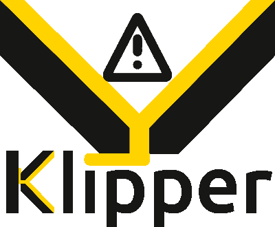

---
hide:
  - toc
title: Welcome
---

{ .center-image }

Danger-Klipper is a 3d-Printer firmware. It combines the power of a general
purpose computer with one or more micro-controllers. See the
[features](Features.md) document for more information on why you
should use Klipper.

!!! danger
    This is a fork of [Klipper](https://www.klipper3d.org/), with the goal
    of supporting features and behavior that could be "risky" if used
    incorrectly. If you are not an experienced Klipper user, it is
    recommended that you familiarize yourself with the original Klipper
    project first.

To begin using Danger-Klipper start by [installing](Installation.md) it.

Danger-Klipper is Free Software. Read the [documentation](Overview.md) or
view [the Danger-Klipper code on github](https://github.com/DangerKlippers/danger-klipper).
We depend on the generous support from our [sponsors](Sponsors.md).
